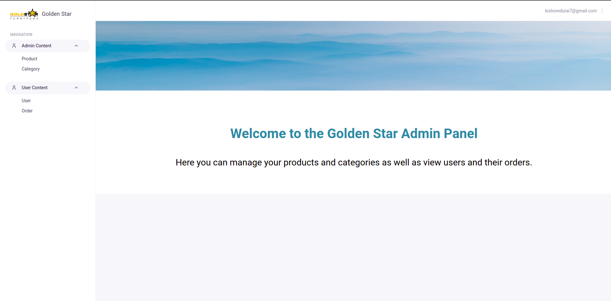

# Golden Star Ecommerce Website

## Introduction
A virtual ecommerce website using Node js, Express js, and Mongoose.

## Submission Category: 

This Project comes under E-Commerce Creation

## Technology

The application is built with:

- Node.js version 12.16.3
- MongoDB version 4.2.0
- Express version 4.16.1
- Bootstrap version 4.4.1
- FontAwesome version 5.13.0
- Stripe API v3: used for payment in the checkout page
- Passport: used for authentication

## Features

The application displays a Furniture store that contains virtual products and contact information.

### User:

- Create an account, login or logout
- Browse available products added by the admin
- Add products to the shopping cart
- Delete products from the shopping cart
- Display the shopping cart
- To checkout, a user must be logged in
- Checkout information is processed using stripe and the payment is send to the admin
- The profile contains all the orders a user has made


### Admin:

- Login or logout to the admin panel
- View all the information stored in the database. They can view/add/edit/delete orders, users, products and categories. The cart model cannot be modified by an admin because a cart is either modified by the logged in user before the purchase or deleted after the purchase.


## Run

To run this application, you have to set your own environmental variables.


- MONGO_URI: this is the connection string of your MongoDB Atlas database.

- ADMIN_EMAIL, ADMIN_PASSWORD: the email and password used to log into the admin panel using AdminBro. You can put any email and password here.

- ADMIN_COOKIE_NAME, ADMIN_COOKIE_PASSWORD: the cookie name and password used in the AdminBro authentication method. You can put any strings here.

- SESSION_SECRET: a secret message for the session. You can use any string here.

- Then run following commands:
 
  ```sh
  npm install 
  ```

    ```sh
  npm start 
  ```


## Demo

The application is deployed to Heroku and can be accessed through the following link:

[Golden Furniter](https://goldenfurniture.herokuapp.com/)

### Admin Login Credentials

add / admin to the URL

Username: admin@goldenstar.com <br>
Password: admin@123

## Screenshot


###  Home Page


###  Products Page


###  cart Page


###  Signup Page


###  Admin Dashboard Page




## License & Copyright

© [kishoredurai](https://www.linkedin.com/in/kishore-durai-7932321a4/)

Licensed under [Apache License Version 2.0, January 2004](LICENSE)
